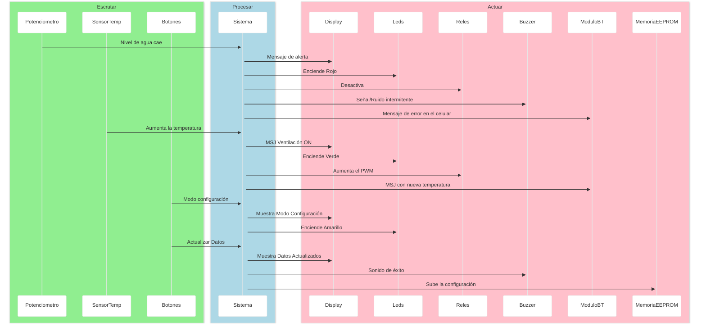

```mermaid
%%{init: { 'theme': 'base', 'themeVariables': { 'background': '#ffffff', 'primaryColor': '#ffffff', 'mainBkg': '#ffffff', 'actorBkg': '#ffffff', 'boxBkgColor': '#ffffff' }}}%%
sequenceDiagram
    box lightgreen Escrutar
    participant Potenciometro
    participant SensorTemp
    participant Botones
    end
    box lightblue Procesar
    participant Sistema
    end
    box pink Actuar
    participant Display
    participant Leds
    participant Reles
    participant Buzzer
    participant ModuloBT
    participant MemoriaEEPROM
    end
    Potenciometro->>+Sistema: Nivel de agua cae
    Sistema->>+Display: Mensaje de alerta
    Sistema->>+Leds: Enciende Rojo
    Sistema->>+Reles: Desactiva
    Sistema->>+Buzzer: Señal/Ruido intermitente
    Sistema->>+ModuloBT: Mensaje de error en el celular
    SensorTemp->>+Sistema: Aumenta la temperatura
    Sistema->>+Display: MSJ Ventilación ON
    Sistema->>+Leds: Enciende Verde
    Sistema->>+Reles: Aumenta el PWM
    Sistema->>+ModuloBT: MSJ con nueva temperatura
    Botones->>+Sistema: Modo configuración
    Sistema->>+Display: Muestra Modo Configuración
    Sistema->>+Leds: Enciende Amarillo
    Botones->>Sistema: Actualizar Datos
    Sistema->>+Display: Muestra Datos Actualizados
    Sistema->>+Buzzer: Sonido de éxito
    Sistema->>+MemoriaEEPROM: Sube la configuración

```
