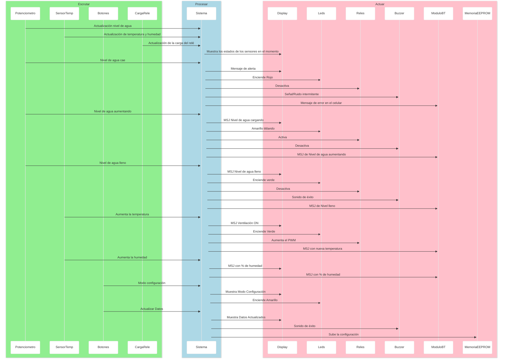

```mermaid
%%{init: { 'theme': 'base', 'themeVariables': { 'background': '#ffffff', 'primaryColor': '#ffffff', 'mainBkg': '#ffffff', 'actorBkg': '#ffffff', 'boxBkgColor': '#ffffff' }}}%%
sequenceDiagram
    box lightgreen Escrutar
    participant Potenciometro
    participant SensorTemp
    participant Botones
    participant CargaRele
    end
    box lightblue Procesar
    participant Sistema
    end
    box pink Actuar
    participant Display
    participant Leds
    participant Reles
    participant Buzzer
    participant ModuloBT
    participant MemoriaEEPROM
    end
    Potenciometro->>+Sistema: Actualización nivel de agua
    SensorTemp->>+Sistema: Actualización de temperatura y humedad
    CargaRele->>+Sistema: Actualización de la carga del relé
    Sistema->>+Display: Muestra los estados de los sensores en el momento
    Potenciometro->>+Sistema: Nivel de agua cae
    Sistema->>+Display: Mensaje de alerta
    Sistema->>+Leds: Enciende Rojo
    Sistema->>+Reles: Desactiva
    Sistema->>+Buzzer: Señal/Ruido intermitente
    Sistema->>+ModuloBT: Mensaje de error en el celular
    Potenciometro->>+Sistema: Nivel de agua aumentando
    Sistema->>+Display: MSJ Nivel de agua cargando
    Sistema->>Leds: Amarillo titilando
    Sistema->>Reles: Activa
    Sistema->>Buzzer: Desactiva
    Sistema->>ModuloBT: MSJ de Nivel de agua aumentando 
    Potenciometro->>+Sistema: Nivel de agua lleno
    Sistema->>+Display: MSJ Nivel de agua lleno
    Sistema->>+Leds: Enciende verde
    Sistema->>+Reles: Desactiva
    Sistema->>+Buzzer: Sonido de éxito
    Sistema->>+ModuloBT: MSJ de Nivel lleno
    SensorTemp->>+Sistema: Aumenta la temperatura
    Sistema->>+Display: MSJ Ventilación ON
    Sistema->>+Leds: Enciende Verde
    Sistema->>+Reles: Aumenta el PWM
    Sistema->>+ModuloBT: MSJ con nueva temperatura
    SensorTemp->>+Sistema: Aumenta la humedad
    Sistema->>+Display: MSJ con % de humedad
    Sistema->>+ModuloBT: MSJ con % de humedad
    Botones->>+Sistema: Modo configuración
    Sistema->>+Display: Muestra Modo Configuración
    Sistema->>+Leds: Enciende Amarillo
    Botones->>+Sistema: Actualizar Datos
    Sistema->>+Display: Muestra Datos Actualizados
    Sistema->>+Buzzer: Sonido de éxito
    Sistema->>+MemoriaEEPROM: Sube la configuración

```
